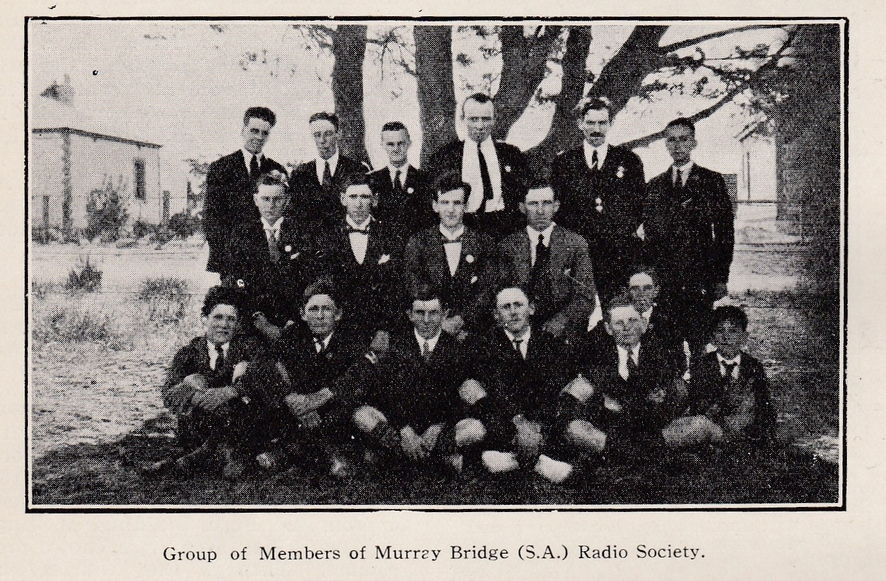

The Murray Bridge Radio Society was formed on **14 December 1922**. The following text is from the *[Mount Barker Courier and Onkaparinga and Gumeracha Advertiser](files/formation-of-murray-bridge-radio-society.pdf)*, Friday 12 January 1923.

> On December 14, 1922, a wireless society was formed at Murray Bridge, entitled "Murray Bridge Radio Society," with a membership 15. The following were elected officers:
>
> President R. E. V. Stephens; vice-president W. J. Matthews; Hon. treasurer C. P. Pfeiffer; Hon. secretary F. G. Miller; council C. M. Parson, R. R. Frith, S. L. Prime, H. Andrews, G. C. G. Beavers, P. R. Scot, R. W. G. Francis.
>
> The objects of the society are to aid members with advice and instruction in radio-telegraphy and telephony. General meetings are to be held fortnightly at the hon. secretary's residence, (67) Eleanor Terrace, at 8 p.m., and members may avail themselves of buzzer practice every Thursday evening 8 to 8:30 p.m. Members of the club are very fortunate in having Mr. Miller's station (Call 5BF) placed at their disposal by him for use as a club room. He has a splendid three-wire aerial of the L type, which will soon be increased to 60 feet in height. The station consists of a complete transmitting and receiving set. The sending part is of the spark type, but in the near future it is Mr. Miller's intention to install a continuous wave set using the latest 5 watt power valve. The receiving set consists of a valve set, both Dutch, and a Radiotron UV 200 valve being used. With the use of the valve all commercial stations Australia are heard every day. The age limit for members is 14 or over, but persons desiring to join under that age may become auxiliary members. A cordial invitation is extended to all persons interested in radio-telegraphy to attend on meeting nights and listen to various commercial messages from all parts of Australia. In the near future, it is the Society's intention to conduct experiments with other amateurs in the state in radio-telephony, that is wireless concerts, lectures etc. A transmitting license is being sought for the purpose of relaying to members having short range set messages from long distance stations, time signals, weather reports etc. The next general meeting will be held Monday evening next January 15th at 8 p.m. Mr Miller will contribute a talk on "Aerials" illustrated by means of a blackboard.

[Original 1923 newspaper clipping (PDF)](files/formation-of-murray-bridge-radio-society.pdf)
