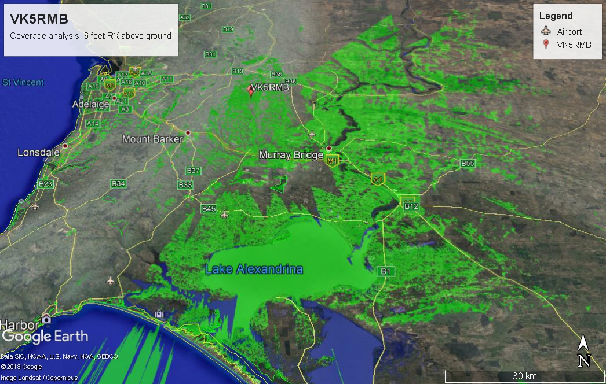

To use the Google Earth files, download the zip and install Google Earth. Opening the `.kml` file overlays repeater coverage so you can zoom in.

{fig-alt="VK5RMB regional coverage plot" .cover-map}

- [Google Earth files for VK5RMB](../files/vk5rmb.zip)
